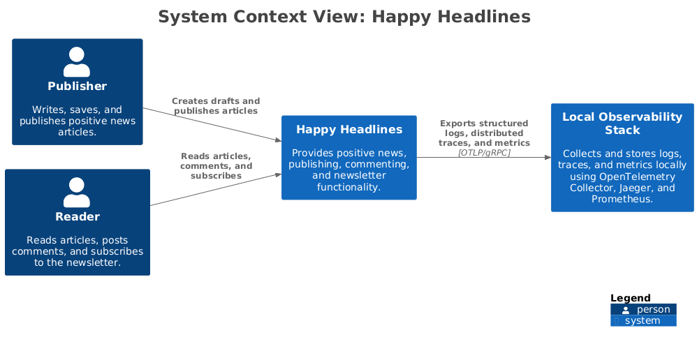
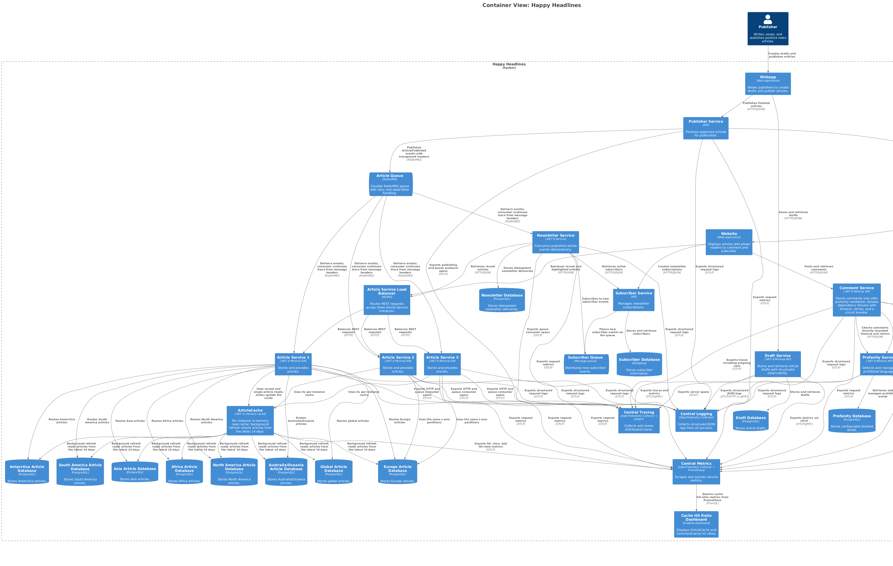

# Happy Headlines

Semester project for **Development of Large Systems (E2026)**.

Happy Headlines is a global platform for publishing and distributing positive news. The system supports article drafting and publishing, profanity filtering, reader comments, newsletter subscriptions, and newsletter distribution.

## Week 35: C4 architecture

The first-week deliverable contains:

- A C4 Level 1 System Context diagram.
- A C4 Level 2 Container diagram.
- A Structurizr DSL model as the architecture source of truth.
- A Docker Compose setup for viewing the diagrams locally.

The W35 Structurizr model remains the architecture source of truth. W36 adds a runnable ArticleService implementation without removing the existing system context or container diagrams.

## Week 36: ArticleService

ArticleService is a .NET 8 ASP.NET Core Minimal API backed by PostgreSQL. Three identical service containers run behind NGINX on port `8081`; Structurizr remains available on port `8080`.

The article record contains `id`, `title`, `body`, `continent`, `is_global`, `created_at`, and `updated_at`. Non-global articles are routed to one of seven continent databases. Global articles are routed to the separate global database.

The REST endpoints are:

```text
POST   /articles
GET    /articles
GET    /articles/{id}
PUT    /articles/{id}
DELETE /articles/{id}
GET    /health
```

## C4 Level 1: System Context

The System Context diagram presents Happy Headlines as one software system and shows its two primary users:

- **Publisher:** Creates drafts and publishes articles.
- **Reader:** Reads articles, posts comments, and subscribes to newsletters.



[View the System Context diagram key](docs/architecture/diagrams/system-context-key.png)

## C4 Level 2: Containers

The Container diagram opens the Happy Headlines system and shows its web applications, services, databases, and asynchronous queues.



[View the Container diagram key](docs/architecture/diagrams/container-key.png)

## Architecture source

The diagrams are defined as code in:

```text
docs/architecture/workspace.dsl
```

The DSL file is the source of truth. The exported PNG files make the diagrams directly visible on GitHub.

Regenerate the C4 screenshots from the DSL with the pinned Structurizr CLI and PlantUML images:

```bash
./scripts/export-c4-diagrams.sh
```

## Run locally

Copy `.env.example` to an untracked `.env` and replace each `replace_with_...` placeholder with local-only values before using Compose. `.env` is ignored by Git and is not part of this copy.

Build and start the complete W35/W36 stack:

```bash
docker compose config
docker compose build
docker compose up -d
```

ArticleService through NGINX: `http://localhost:8081`

Structurizr: `http://localhost:8080`

Run all unit and integration tests:

```bash
dotnet test HappyHeadlines.sln
```

Verify that NGINX reaches all three service instances:

```bash
./tests/verify-load-balancer.sh
```

Create continent and global articles through NGINX:

```bash
curl -i -X POST http://localhost:8081/articles \
	-H 'Content-Type: application/json' \
	-d '{"title":"Europe","body":"A local story","continent":"Europe","isGlobal":false}'

curl -i -X POST http://localhost:8081/articles \
	-H 'Content-Type: application/json' \
	-d '{"title":"Global","body":"A global story","continent":null,"isGlobal":true}'
```

Verify database routing:

```bash
curl http://localhost:8081/articles
docker compose exec europe-db psql -U articles -d articles -c 'SELECT title, continent, is_global FROM articles;'
docker compose exec global-db psql -U articles -d articles -c 'SELECT title, continent, is_global FROM articles;'
```

Check status and stop the stack:

```bash
docker compose ps
docker compose down
```

## Week 38: DraftService and observability

DraftService is a .NET 8 Minimal API on `http://localhost:8084` with PostgreSQL persistence in DraftDatabase. It exposes:

```text
POST   /drafts
GET    /drafts
GET    /drafts/{id}
PUT    /drafts/{id}
DELETE /drafts/{id}
GET    /health
```

All application services use the shared library in `src/Observability`. It emits structured JSON request logs with timestamp, level, service, environment, W3C `trace_id`, `span_id`, `request_id`, operation, duration, outcome, status code, and error details when relevant. Request bodies and sensitive values are deliberately excluded. OpenTelemetry instruments ASP.NET Core and outgoing HTTP calls; `TraceContextHandler` propagates `traceparent` and `tracestate`.

The central stack is:

- OpenTelemetry Collector receives OTLP logs, traces, and metrics on ports `4317` and `4318`.
- Collector stores logs in `/var/lib/otel/logs.json` and traces in `/var/lib/otel/traces.json` on the `observability-data` volume.
- Jaeger receives the trace stream and exposes the UI at `http://localhost:16686`.
- Collector health is available at `http://localhost:13133`.
- Prometheus scrapes Collector-exported metrics and stores a queryable TSDB at `http://localhost:9090`.

Start and verify W38:

```bash
docker compose config
docker compose build
docker compose up -d --wait
dotnet test HappyHeadlines.sln
curl http://localhost:8084/health
curl http://localhost:13133/
curl http://localhost:16686/api/services
```

Verify DraftService CRUD:

```bash
draft=$(curl -fsS -X POST http://localhost:8084/drafts \
	-H 'Content-Type: application/json' \
	-d '{"title":"Draft","body":"First version","author":"publisher"}')
draft_id=$(printf '%s' "$draft" | jq -r .id)
curl -fsS http://localhost:8084/drafts/$draft_id
curl -fsS -X PUT http://localhost:8084/drafts/$draft_id \
	-H 'Content-Type: application/json' \
	-d '{"title":"Updated","body":"Second version","author":"publisher"}'
curl -i -X DELETE http://localhost:8084/drafts/$draft_id
```

Verify structured logs and central trace storage after a request:

```bash
curl -i -H 'X-Request-ID: w38-check-001' http://localhost:8084/health
collector_id=$(docker compose ps -q otel-collector)
docker cp "$collector_id:/var/lib/otel/logs.json" /tmp/hh-logs.json
docker cp "$collector_id:/var/lib/otel/traces.json" /tmp/hh-traces.json
test -s /tmp/hh-logs.json && test -s /tmp/hh-traces.json
grep -E '"trace_id"|"span_id"|"request_id"|"operation"|"duration"|"outcome"' /tmp/hh-logs.json | head
curl http://localhost:16686/api/traces?service=draft-service
curl 'http://localhost:9090/api/v1/query?query=happy_headlines_http_server_request_duration_seconds_count'
```

For troubleshooting, inspect `docker compose logs --no-color draft-service otel-collector jaeger`, then check `docker compose ps` and the collector health endpoint. Stop the stack with `docker compose down`.

## Week 39: Distributed publishing

W39 adds PublisherService on `http://localhost:8085`, NewsletterService on `http://localhost:8086`, and a durable RabbitMQ ArticleQueue with management UI on `http://localhost:15672`. RabbitMQ and Grafana credentials are supplied through the ignored local `.env` file. PublisherService first validates article text directly with ProfanityService; it rejects blocked content and fails closed with `503` when validation is unavailable. It then publishes `ArticlePublishedMessage` events. ArticleService and NewsletterService consume separate fanout queues, so both receive each publication.

Consumers preserve W3C `traceparent` and `tracestate` values from RabbitMQ message headers when creating consumer spans. Messages are idempotent: ArticleService uses the article UUID as the database key, and NewsletterService enforces one delivery per article UUID. A failed subscriber message is retried twice on that subscriber's own queue, then routed to its subscriber-specific dead-letter queue through the durable direct exchange `article.dead.v2`.

Start and publish an article:

```bash
docker compose config
docker compose build
docker compose up -d --wait

article_id=$(uuidgen)
curl -i -X POST http://localhost:8085/publish \
	-H 'Content-Type: application/json' \
	-H 'X-Request-ID: w39-publish-001' \
	-d "{\"articleId\":\"$article_id\",\"title\":\"Distributed publishing\",\"body\":\"A positive story\",\"continent\":\"Europe\",\"isGlobal\":false}"
```

The request is safe to retry with the same `articleId`: article persistence and newsletter delivery are idempotent by article ID.

Verify queue delivery and newsletter handling:

```bash
set -a
. ./.env
set +a
curl http://localhost:8081/articles
curl http://localhost:8086/newsletters/$article_id
curl -u "$RABBITMQ_DEFAULT_USER:$RABBITMQ_DEFAULT_PASS" http://localhost:15672/api/queues/%2F/article-service.published.v2
curl -u "$RABBITMQ_DEFAULT_USER:$RABBITMQ_DEFAULT_PASS" http://localhost:15672/api/queues/%2F/newsletter-service.published.v2
```

Jaeger verification for one distributed trace:

```bash
curl 'http://localhost:16686/api/traces?service=publisher-service&limit=20'
curl 'http://localhost:16686/api/operations?service=article-service'
curl 'http://localhost:16686/api/operations?service=newsletter-service'
```

The trace should contain the publisher HTTP span, RabbitMQ publish/consume spans, ArticleService processing, and NewsletterService processing under one trace ID. To inspect dead-letter behavior, stop `newsletter-db` to cause the active subscriber to fail, publish a message, then inspect `newsletter-service.published.v2.dead` after two retries:

```bash
docker compose stop newsletter-db
set -a
. ./.env
set +a
curl -X POST http://localhost:8085/publish \
	-H 'Content-Type: application/json' \
	-d "{\"articleId\":\"$(uuidgen)\",\"title\":\"Dead letter check\",\"body\":\"Test\",\"continent\":\"Europe\",\"isGlobal\":false}"
curl -u "$RABBITMQ_DEFAULT_USER:$RABBITMQ_DEFAULT_PASS" http://localhost:15672/api/queues/%2F/newsletter-service.published.v2.dead
docker compose start newsletter-db
docker compose down
```

## Week 37: CommentService resilience

W37 adds CommentService on `http://localhost:8082` and a separate ProfanityService. CommentService validates every comment directly through ProfanityService before writing to CommentDatabase. If validation is profane, the comment is rejected. If ProfanityService times out or remains unavailable after bounded retries, the request returns `503` with `error: profanity_unavailable`; no comment is stored.

ProfanityService seeds its configurable blocked-word list from the `BLOCKED_WORDS` environment variable (comma-separated; Compose defaults to `spam,scam`) into ProfanityDatabase.

The resilience policy uses a 250 ms per-attempt timeout, three attempts, and a circuit breaker with Closed, Open, and Half-Open states. The circuit opens after three failed validation calls and probes recovery after five seconds. While Open, `POST /comments` fails closed with `503`, and `/health` also returns `503 not_ready` until validation recovers.

Start the W36/W37 stack and run all tests:

```bash
docker compose config
docker compose build
docker compose up -d --wait
dotnet test HappyHeadlines.sln
```

Normal comment flow and profanity rejection:

```bash
article_id=$(uuidgen)
curl -i -X POST http://localhost:8082/comments \
	-H 'Content-Type: application/json' \
	-d "{\"articleId\":\"$article_id\",\"author\":\"reader\",\"body\":\"A kind comment\"}"

curl -i -X POST http://localhost:8082/comments \
	-H 'Content-Type: application/json' \
	-d "{\"articleId\":\"$article_id\",\"author\":\"reader\",\"body\":\"This is spam\"}"
```

Simulate ProfanityService failure. Four requests exercise the three bounded validation attempts and then the Open-circuit response; every request fails closed with `503`:

```bash
docker compose stop profanity-service
for attempt in 1 2 3 4; do
	curl -i -X POST http://localhost:8082/comments \
		-H 'Content-Type: application/json' \
		-d "{\"articleId\":\"$article_id\",\"author\":\"reader\",\"body\":\"Validation is required\"}"
done
curl http://localhost:8082/health
```

Recover ProfanityService and verify Half-Open to Closed recovery:

```bash
docker compose start profanity-service
sleep 6
curl http://localhost:8083/health
curl http://localhost:8082/health
curl -i -X POST http://localhost:8082/comments \
	-H 'Content-Type: application/json' \
	-d "{\"articleId\":\"$article_id\",\"author\":\"reader\",\"body\":\"Validation works again\"}"
docker compose ps
docker compose down
```

## Week 40: Article and comment caches

ArticleService has a per-instance in-memory `ArticleCache`. Its background refresh runs immediately at service startup and then periodically; the default period is 300 seconds and is configurable with `ARTICLE_CACHE_REFRESH_INTERVAL_SECONDS` (minimum one second). Each successful refresh atomically replaces the snapshot with articles whose `created_at` is between the current time and 14 days earlier. If the database refresh fails, the last successful snapshot remains available. `GET /articles/recent` and cached `GET /articles/{id}` use this cache; the original `GET /articles` continues to return the complete database result.

CommentService has a per-instance read-through `CommentCache`. A miss loads that article's comments from CommentDatabase. It tracks at most 30 article IDs in LRU order; each hit, miss-population, or access updates recency. After a successful comment write, the affected article entry is invalidated so subsequent reads reload current data. Both services expose `GET /cache/metrics` with cumulative `hits`, `misses`, and `hitRatio`, defined as `hits / (hits + misses)` and `0` before the first access. The same metrics are exported to Prometheus.

Start the locally provisioned cache dashboard with the full stack:

```bash
docker compose config
docker compose build
docker compose up -d --wait
```

Open Grafana at `http://localhost:3000` using the local-only `GF_SECURITY_ADMIN_USER` and `GF_SECURITY_ADMIN_PASSWORD` values from `.env`, then open the provisioned **Happy Headlines Cache Hit Ratio** dashboard. It shows the ArticleCache and CommentCache ratios from Prometheus. The refresh period can be changed for all ArticleService replicas with `ARTICLE_CACHE_REFRESH_INTERVAL_SECONDS`; the container default is 300 seconds.

Exercise and inspect the caches:

```bash
curl http://localhost:8081/articles/recent
curl http://localhost:8081/cache/metrics
curl 'http://localhost:8081/articles/<article-id>'
curl 'http://localhost:8082/comments?articleId=<article-id>'
curl http://localhost:8082/cache/metrics
curl 'http://localhost:9090/api/v1/query?query=happy_headlines_cache_hit_ratio'
```

Run the deterministic 14-day refresh, refresh-failure retention, cache hit/miss, write invalidation, and 30-entry LRU tests without writing build artifacts into tracked `bin/obj` directories:

```bash
HAPPY_HEADLINES_ROOT="$PWD" dotnet test tests/ArticleService.Tests/ArticleService.Tests.csproj \
	--artifacts-path /tmp/happy-headlines-test-artifacts
```

## Complete verification

Run the complete local stack and all tests from the repository root:

```bash
docker compose config
docker compose build
docker compose up -d --wait
HAPPY_HEADLINES_ROOT="$PWD" dotnet test HappyHeadlines.sln \
	--artifacts-path /tmp/happy-headlines-test-artifacts
./tests/verify-load-balancer.sh
./scripts/export-c4-diagrams.sh
```

Exercise z-axis routing by creating one Europe article and one global article, then query `europe-db` and `global-db` using the IDs returned from `POST /articles`. Exercise circuit recovery using the W37 commands above. Exercise W39 by publishing an article, checking its row in the matching article database and its newsletter delivery, and matching the `POST /publish`, `consume article-service.published.v2`, and `consume newsletter-service.published.v2` spans by one trace ID in Jaeger. Prometheus queries are available at `http://localhost:9090`; Collector and RabbitMQ management are at `http://localhost:13133` and `http://localhost:15672`. Stop services with `docker compose down`; this preserves named database, RabbitMQ, and observability volumes.