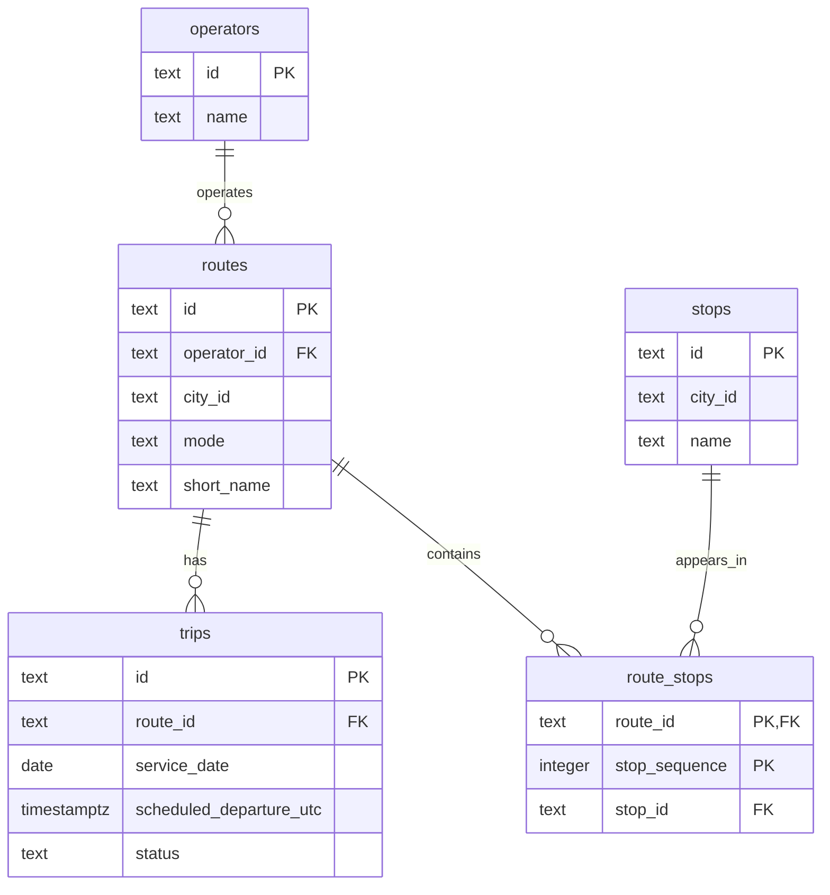

# MobilityTicketing — Lecture 1 ER diagram

## Reading the diagram

- PK means primary key; FK means foreign key.
- `||` means exactly one; `o{` means zero or many.
- Each route belongs to exactly one operator; an operator may have zero or many routes.
- Each trip belongs to exactly one route; a route may have zero or many trips.
- Each route-stop row belongs to exactly one route and references exactly one stop.
- A route may have zero or many route-stop rows. A stop may appear in zero or many route-stop rows.
- All columns in this schema are required (NOT NULL, either explicitly or through the primary key).

## Modelling decision

The primary key of route_stops is the combination (route_id, stop_sequence), not two separate primary keys. Each position is unique within a route, while different routes can use the same sequence numbers. A route may revisit the same stop at different positions.

route_stops connects routes and stops, representing their many-to-many relationship while recording stop order. The stop_sequence CHECK requires values greater than zero, but does not require consecutive numbering.

## Scope and correspondence to SQL

The diagram shows the five implemented tables; no difference in keys or relationships is intended. The SQL does not require an operator to have routes or a route to have stops or trips, hence the zero minimums. city_id is a required text value, not a foreign key: there is no cities table in this slice. The schema also does not enforce matching city_id values between a route and its stops.
